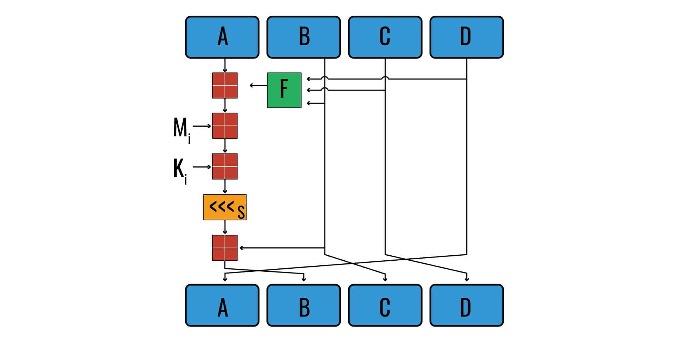

# MD5 Algorithm Implemented in C

## What is MD5?  
MD5 is a hash function invented by Ronald Rivest (MIT) in 1991 to replace his older hash function, MD4.  
A hash function is a function that takes an input value and generates fixed-length output values to represent the original input.  
They are generally used for encryption, data compression, and generating indices.

MD5 was designed for data security and encryption, but today its primary use is being a checksum to verify data integrity against unintentional corruption.  

This is because it is no longer secure due to the fact that a tampered file could have the same exact hash as the original file.  
This makes it impossible to be certain that the file is actually secure or not.  

Because of this, most security experts recommend that MD5 should be replaced with SHA-2.

## The MD5 Process


MD5 has 4 major stages:
1. Generating M's + K's
2. Initialization vectors + Operations
3. Final modular addition
4. Concatenating final results

As an example, we'll encrypt the message "Lord Konstantinovich" and show the results at each stage.

For reference:
* Each iteration of the algorithm is referred to as an operation.
* Every 16 operations is 1 round.

   Round 1 = Operations 1-16  
   Round 2 = Operations 17-32  
   Round 3 = Operations 33-48  
   Round 4 = Operations 49-64

* *i* denotes the current operation we are on.


### I. Generating M's + K's
#### Padding
MD5's inputs are broken up into 512-bit blocks, and padding is utilized to fill up any potential empty space in a block. For example, our input is 160 bits (20 characters) long. To meet the required 512-bit block, the MD5 algorithm replaces the next byte with `10000000` (128), then adds enough 0s to reach 448 bits; in this case, the padding succeeding our input would be `10000000`, followed by 280 zeros. 

But what about the last 64 bits? The algorithm reserves these bits to display the message's length in binary. Due to the input length restrictions, the last 32 bits will always be 0. So we will just replace the remaining 32 bits with `00000000 00000000 00000000 10100000` (160 in binary).

**Padding with inputs greater than 448 bits**  
If our input is greater than 448 bits, then it would be split between multiple blocks. The last block, however, must have at least 1 bit of padding, in addition to the 64 bits at the end reserved for the message's length in binary. 

If our remaining input was 447 bits, then the last block would be the last 447 bits, followed by a 1 and then the reserved 64 bits. 

If our remaining input was exactly 448 bits, we would need instead need two blocks, as a single block would not be able to fit 448 bits alongside the required padding and binary message display; the second-to-last block would have the 448 bits, then a 1 followed by 63 zeros. The padding would extend to the 448th bit of the last block, totaling to 512 bits of padding. 

If our remaining input was 449 bits, the second-to-last block would have these 449 bits, followed by a 1 and 62 zeros; the last block would contain 448 zeros, followed by the 64-bit message length.

#### The M input
Now that our initial input has been formatted properly, we can start generating our M's. The algorithm takes each 512-bit block, and splits them into 16 32-bit "words"; let's refer to them as M0, M1, M2, all the way to M15. After converting these values to hexadecimal, these 16 values become the inputs to the respective 16 operations in each round. In each round however, the M values are added in a different order:

First round: M0, M1, M2, M3, M4, M5, M6, M7, M8, M9, M10, M11, M12, M13, M14, M15  
Second round: M1, M6, M11, M0, M5, M10, M15, M4, M9, M14, M3, M8, M13, M2, M7, M12  
Third round: M5, M8, M11, M14, M1, M4, M7, M10, M13, M0, M3, M6, M9, M12, M15, M2  
Fourth round: M0, M7, M14, M5, M12, M3, M10, M1, M8, M15, M6, M13, M4, M11, M2, M9

**Our M's**
```
M0 = 01100100 01110010 01101111 01001100  0x64726f4c     M8 = 00000000 00000000 00000000 00000000  0x00000000
M1 = 01101110 01101111 01001011 00100000  0x6e6f4b20     M9 = 00000000 00000000 00000000 00000000  0x00000000
M2 = 01101110 01100001 01110100 01110011  0x6e617473    M10 = 00000000 00000000 00000000 00000000  0x00000000
M3 = 01101111 01101110 01101001 01110100  0x6f6e6974    M11 = 00000000 00000000 00000000 00000000  0x00000000
M4 = 01101000 01100011 01101001 01110110  0x68636976    M12 = 00000000 00000000 00000000 00000000  0x00000000
M5 = 00000000 00000000 00000000 10000000  0x00000080    M13 = 00000000 00000000 00000000 00000000  0x00000000
M6 = 00000000 00000000 00000000 00000000  0x00000000    M14 = 00000000 00000000 00000000 10100000  0x000000a0
M7 = 00000000 00000000 00000000 00000000  0x00000000    M15 = 00000000 00000000 00000000 00000000  0x00000000
```

### II. Initialization vectors + Operations
#### Initialization vectors
The initialization vectors are the values that are going to be continuously modified throughout the MD5 algorithm.  
The initial vectors are given to us and stored as A, B, C, and D.  
```
A = 0x67452301
B = 0xefcdab89
C = 0x98badcfe
D = 0x10325476
```

#### Operations
The operations are the process by which the initialization vectors are transformed into the hash.  



Each operation has 6 parts:
1. Boolean algebra function (F, G, H, I)
2. Adding M<sub>i</sub>
3. Adding K<sub>i</sub>
4. Hash rotation
5. Adding the result of the previous operation (B)
6. Vector rotation

Operations are performed a total of 64 times throughout the algorithm.    
Each operation uses a different value for M<sub>i</sub> and K<sub>i</sub>.  
The boolean algebra function and hash rotation scheme change every round operations.

**Boolean algebra function (F, G, H, I)**  
The first part of each operation is the boolean algebra function.  
This function creates a result by performing boolean algebra on initialization vectors B, C, and D.  

Boolean algebra is a branch of mathematics that deals with operations on logical values.  
For MD5, we use 4 logical operators:
1. ∧ AND
2. ∨ OR
3. ¬ NOT
4. ⊕ XOR

MD5 uses 4 boolean algebra functions:
1. F: (B∧C)∨(¬B∧D) = `(B&C) | (~B&D)`
2. G: (B∧D)∨(C∧¬D) =  `(B&D) | (C&~D)`
3. H: B⊕C⊕D = `B ^ C ^ D`
4. I: C⊕(B∨¬D) = `C ^ (B|~D)`

F is used for round 1 (operations 1-16)  
G is used for round 2 (operations 17-32)  
H is used for round 3 (operations 33-48)  
I is used for round 4 (operations 49-64)

We add the result of these functions to initialization vector A.

**Our result for F:**
```
result = (0xefcdab89 & 0x98badcfe) | (~0xefcdab89 & 0x10325476)
result = 0x98badcfe
```

**Our result for adding F:**
```
result = 0x67452301 + 0x98badcfe
result = 0xffffffff
```

#### Adding M<sub>i</sub>
Next we add the appropriate M value to the result we got from the previous boolean algebra function.  
Which M value we add depends on the current operation and round we are on:
* Round 1: *i* = *i*
* Round 2: *i* = (5*i* + 1) % 16
* Round 3: *i* = (3*i* + 5) % 16
* Round 4: *i* = 7*i* % 16

**Our result for adding M<sub>i</sub>:**
```
result = 0xffffffff + 0x64726f4c
result = 0x64726f4b
```

#### Adding K<sub>i</sub>
We then add the appropriate K value to the result of the previous step.  
The K value we add corresponds directly to which operation we are on, so we will always add the *i*th K value to our result.

**Our result for adding K<sub>i</sub>:**
```
result = 0x64726f4b + 0xd76aa478
result = 0x3bdd13c3
```

#### Hash rotation

### III. Final modular addition


### IV. Concatenating final results
