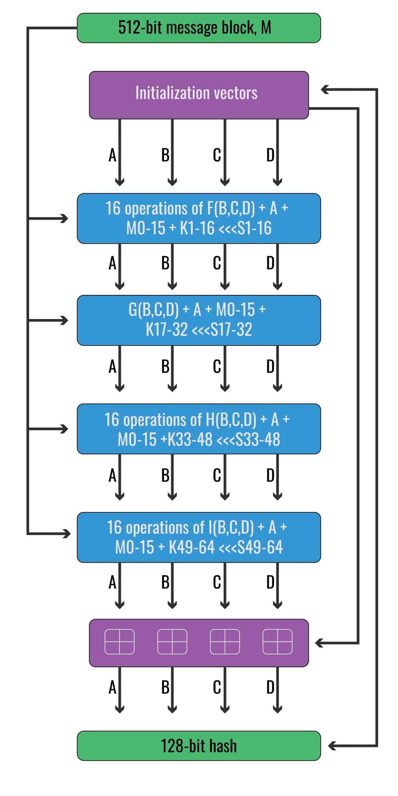

# MD5 Algorithm Implemented in C

## What is MD5?  
MD5 is a hash function invented by Ronald Rivest (MIT) in 1991 to replace his older hash function, MD4.  
A hash function is a function that takes an input value and generates fixed-length output values to represent the original input.  
They are generally used for encryption, data compression, and generating indices.

MD5 was designed for data security and encryption, but today its primary use is being a checksum to verify data integrity against unintentional corruption.  

This is because it is no longer secure due to the fact that a tampered file could have the same exact hash as the original file.  
This makes it impossible to be certain that the file is actually secure or not.  

Because of this, most security experts recommend that MD5 should be replaced with SHA-2.

## The MD5 Process

Can be generalized into 4 major stages:
1. Generating M's
2. Operations
3. Final modular addition
4. Concatenating final results

### I. Generating M's

### II. Operations

### III. Final modular addition

### IV. Concatenating final results
